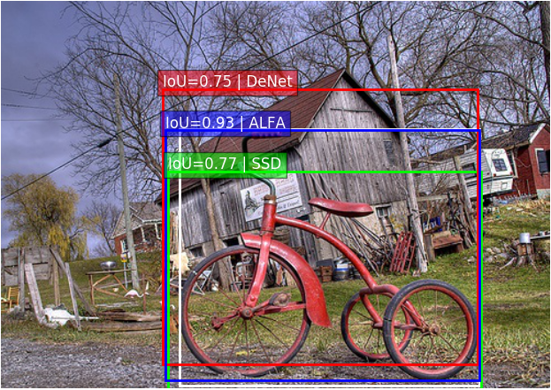

# ALFA: Agglomerative Late Fusion Algorithm for Object Detection

By Evgenii Razinkov, Iuliia Saveleva, Jiří Matas

The paper "ALFA: Agglomerative Late Fusion Algorithm for Object Detection" is accepted 
to ICPR 2018, the link will be added here as soon as the paper become available.



<table>
    <thead>
        <tr>
            <th rowspan=2>Detector</th>
            <th rowspan=2>fps(Hz)</th>
            <th colspan=2>PASCAL VOC 2007</th>
            <th colspan=2>PASCAL VOC 2012</th>
        </tr>
        <tr>
            <th>mAP-s(%)</th>
            <th>mAP(%)</th>
            <th>mAP-s(%)</th>
            <th>mAP(%)</th>
        </tr>
    </thead>
    <tbody>
        <tr>
            <th>Faster R-CNN</th>
            <th><sub>7</sub></th>
            <th><sub>77.95</sub></th>
            <th><sub>78.83</sub></th>
            <th><sub>72.72</sub></th>
            <th><sub>73.59</sub></th>
        </tr>
        <tr>
            <th>SSD300</th>
            <th><sub>59</sub></th>
            <th><sub>79.26</sub></th>
            <th><sub>80.37</sub></th>
            <th><sub>72.89</sub></th>
            <th><sub>74.17</sub></th>
        </tr>
        <tr>
            <th>DeNet</th>
            <th><sub>33</sub></th>
            <th><sub>78.09</sub></th>
            <th><sub>79.26</sub></th>
            <th><sub>70.73</sub></th>
            <th><sub>72.10</sub></th>
        </tr>
        <tr>
            <th colspan=6>SSD + DeNet</th>
        </tr>
        <tr>
            <th>NMS</th>
            <th><sub>20.3</sub></th>
            <th><sub>83.12</sub></th>
            <th><sub>83.53</sub></th>
            <th><sub>76.80</sub></th>
            <th><sub>77.37</sub></th>
        </tr>
        <tr>
            <th>DBF</th>
            <th><sub>16.9</sub></th>
            <th><sub>83.29</sub></th>
            <th><sub>83.88</sub></th>
            <th><sub>75.74</sub></th>
            <th><sub>76.38</sub></th>
        </tr>
        <tr>
            <th>Fast ALFA</th>
            <th><sub>20.6</sub></th>
            <th><sub>83.87</sub></th>
            <th><sub>84.32</sub></th>
            <th><sub>76.97</sub></th>
            <th><sub>77.82</sub></th>
        </tr>
        <tr>
            <th>ALFA</th>
            <th><sub>18.1</sub></th>
            <th><sub>84.16</sub></th>
            <th><sub>84.41</sub></th>
            <th><sub>77.52</sub></th>
            <th><sub>77.98</sub></th>
        </tr>
                <tr>
            <th colspan=6>SSD + DeNet + Faster R-CNN</th>
        </tr>
        <tr>
            <th>NMS</th>
            <th><sub>5.2</sub></th>
            <th><sub>84.31</sub></th>
            <th><sub>84.43</sub></th>
            <th><sub>78.11</sub></th>
            <th><sub>78.34</sub></th>
        </tr>
        <tr>
            <th>DBF</th>
            <th><sub>4.7</sub></th>
            <th><sub>84.97</sub></th>
            <th><sub>85.24</sub></th>
            <th><sub>75.71</sub></th>
            <th><sub>75.69</sub></th>
        </tr>
        <tr>
            <th>Fast ALFA</th>
            <th><sub>5.2</sub></th>
            <th><sub>85.78</sub></th>
            <th><sub>85.67</sub></th>
            <th><sub>79.16</sub></th>
            <th><sub>79.42</sub></th>
        </tr>
        <tr>
            <th>ALFA</th>
            <th><sub>5.0</sub></th>
            <th><sub>85.90</sub></th>
            <th><sub>85.72</sub></th>
            <th><sub>79.41</sub></th>
            <th><sub>79.47</sub></th>
        </tr>
    </tbody>
</table>

This repository was tested on python 2.7 and 3.5, platforms Linux and Mac OS.

## Draw image from paper

To draw image from paper:
```bash
python ./draw_paper_pic.py \
--alfa_parameters_json="./Algorithm_parameters/ALFA/SSD_DeNet_0.015_single_cross_validation_parameters_2007.json"
```

## Compute fps results and evaluate on PASCAL VOC 2007

Results on PASCAL VOC 2007 are not reproducible due to randomness of a cross-validation procedure.
You can evaluate algorithms on PASCAL VOC 2007 and get results, that would be close to the results in paper.

You will need to download PASCAL VOC 2007 dataset and change "path/to/VOC2007 test/VOC2007" according to location of
dataset on your computer.

### Base Detectors

To get mAP on PASCAL VOC 2007 by 5-fold cross validation:

```bash
python ./cross_validate_base_detector.py \
--dataset_dir="path/to/VOC2007 test/VOC2007" \
--imagenames_filename="./PASCAL_VOC_files/imagenames_2007_test.txt" \
--pickled_annots_filename="./PASCAL_VOC_files/annots_2007_test.pkl" \
--detections_filename="./SSD_detections/SSD_ovthresh_0.015_single_detections_PASCAL_VOC_2007_test.pkl"
```

To get different detectors results use detections paths from the table:

<table>
    <thead>
        <tr>
            <th>Detector</th>
            <th>Detections</th>
        </tr>
    </thead>
    <tbody>
        <tr>
            <th>SSD</th>
            <th><sub>./SSD_detections/SSD_ovthresh_0.015_single_detections_PASCAL_VOC_2007_test.pkl</sub></th>
        </tr>
        <tr>
            <th>DeNet</th>
            <th><sub>./DeNet_detections/DeNet_ovthresh_0.015_single_detections_PASCAL_VOC_2007_test.pkl</sub></th>
        </tr>
        <tr>
            <th>Faster R-CNN</th>
            <th><sub>./Faster_R-CNN_detections/Faster_R-CNN_ovthresh_0.015_single_detections_PASCAL_VOC_2007_test.pkl</sub></th>
        </tr>
    </tbody>
</table>


### ALFA

* To compute fps results:

```bash
python ./validate_ALFA.py \
--dataset_dir="path/to/VOC2007 test/VOC2007" \
--imagenames_filename="./PASCAL_VOC_files/imagenames_2007_test.txt" \
--pickled_annots_filename="./PASCAL_VOC_files/annots_2007_test.pkl" \
--alfa_parameters_json="./Algorithm_parameters/ALFA/SSD_DeNet_0.05_single_cross_validation_parameters_2007.json"
```

* To get mAP on PASCAL VOC 2007 by 5-fold cross validation:

```bash
python ./cross_validate_ALFA.py \
--dataset_dir="path/to/VOC2007 test/VOC2007" \
--imagenames_filename="./PASCAL_VOC_files/imagenames_2007_test.txt" \
--pickled_annots_filename="./PASCAL_VOC_files/annots_2007_test.pkl" \
--alfa_parameters_json="./Algorithm_parameters/ALFA/SSD_DeNet_0.05_single_cross_validation_parameters_2007.json"
```

To get different detectors combinations results in both ALFA and Fast ALFA use parameters from the table:

<table>
    <thead>
        <tr>
            <th>Algorithm</th>
            <th>Parameters</th>
        </tr>
    </thead>
    <tbody>
        <tr>
            <th colspan=2>SSD + DeNet, mAP-s(%)</th>
        </tr>
        <tr>
            <th>Fast ALFA</th>
            <th><sub>SSD_DeNet_0.05_single_cross_validation_parameters_2007.json</sub></th>
        </tr>
        <tr>
            <th>ALFA</th>
            <th><sub>SSD_DeNet_0.015_single_cross_validation_parameters_2007.json</sub></th>
        </tr>
        <tr>
            <th colspan=5>SSD + DeNet, mAP(%)</th>
        </tr>
        <tr>
            <th>Fast ALFA</th>
            <th><sub>SSD_DeNet_0.05_multiple_cross_validation_parameters_2007.json</sub></th>
        </tr>
        <tr>
            <th>ALFA</th>
            <th><sub>SSD_DeNet_0.015_multiple_cross_validation_parameters_2007.json</sub></th>
        </tr>
        <tr>
            <th colspan=2>SSD + DeNet + Faster R-CNN, mAP-s(%)</th>
        </tr>
        <tr>
            <th>Fast ALFA</th>
            <th><sub>SSD_DeNet_Faster_R-CNN_0.05_single_cross_validation_parameters_2007.json</sub></th>
        </tr>
        <tr>
            <th>ALFA</th>
            <th><sub>SSD_DeNet_Faster_R-CNN_0.015_single_cross_validation_parameters_2007.json</sub></th>
        </tr>
            <th colspan=2>SSD + DeNet + Faster R-CNN, mAP(%)</th>
        </tr>
        <tr>
            <th>Fast ALFA</th>
            <th><sub>SSD_DeNet_Faster_R-CNN_0.05_multiple_cross_validation_parameters_2007.json</sub></th>
        </tr>
        <tr>
            <th>ALFA</th>
            <th><sub>SSD_DeNet_Faster_R-CNN_0.015_multiple_cross_validation_parameters_2007.json</sub></th>
        </tr>
    </tbody>
</table>

### DBF

* To compute fps results:

```bash
python ./validate_DBF.py \
--validation_dataset_dir="path/to/VOC2007 test/VOC2007" \
--validation_imagenames_filename="./PASCAL_VOC_files/imagenames_2007_test.txt" \
--validation_pickled_annots_filename="./PASCAL_VOC_files/annots_2007_test.pkl" \
--test_dataset_dir="path/to/VOC2007 test/VOC2007" \
--test_imagenames_filename="./PASCAL_VOC_files/imagenames_2007_test.txt" \
--test_pickled_annots_filename="./PASCAL_VOC_files/annots_2007_test.pkl" \
--dbf_parameters_json="./Algorithm_parameters/DBF/SSD_DeNet_0.015_single_cross_validation_parameters_2007.json"
```

* To get mAP on PASCAL VOC 2007 by 5-fold cross validation:

```bash
python ./cross_validate_DBF.py \
--dataset_dir="path/to/VOC2007 test/VOC2007" \
--imagenames_filename="./PASCAL_VOC_files/imagenames_2007_test.txt" \
--pickled_annots_filename="./PASCAL_VOC_files/annots_2007_test.pkl" \
--dbf_parameters_json="./Algorithm_parameters/DBF/SSD_DeNet_0.015_single_cross_validation_parameters_2007.json"
```

To get different detectors combinations results in DBF use parameters from the table:

<table>
    <thead>
        <tr>
            <th>Algorithm</th>
            <th>Parameters</th>
        </tr>
    </thead>
    <tbody>
        <tr>
            <th colspan=2>SSD + DeNet, mAP-s(%)</th>
        </tr>
        <tr>
            <th>DBF</th>
            <th><sub>SSD_DeNet_0.015_single_cross_validation_parameters_2007.json</sub></th>
        </tr>
        <tr>
            <th colspan=5>SSD + DeNet, mAP(%)</th>
        </tr>
        <tr>
            <th>DBF</th>
            <th><sub>SSD_DeNet_0.015_multiple_cross_validation_parameters_2007.json</sub></th>
        </tr>
        <tr>
            <th colspan=2>SSD + DeNet + Faster R-CNN, mAP-s(%)</th>
        </tr>
        <tr>
            <th>DBF</th>
            <th><sub>SSD_DeNet_Faster_R-CNN_0.015_single_cross_validation_parameters_2007.json</sub></th>
        </tr>
            <th colspan=2>SSD + DeNet + Faster R-CNN, mAP(%)</th>
        </tr>
        <tr>
            <th>DBF</th>
            <th><sub>SSD_DeNet_Faster_R-CNN_0.015_multiple_cross_validation_parameters_2007.json</sub></th>
        </tr>
    </tbody>
</table>

### NMS

* To compute fps results:

```bash
python ./validate_NMS.py \
--dataset_dir="path/to/VOC2007 test/VOC2007" \
--imagenames_filename="./PASCAL_VOC_files/imagenames_2007_test.txt" \
--pickled_annots_filename="./PASCAL_VOC_files/annots_2007_test.pkl" \
--nms_parameters_json="./Algorithm_parameters/NMS/SSD_DeNet_0.015_single_cross_validation_parameters_2007.json"
```

* To get mAP on PASCAL VOC 2007 by 5-fold cross validation:

```bash
python ./cross_validate_NMS.py \
--dataset_dir="path/to/VOC2007 test/VOC2007" \
--imagenames_filename="./PASCAL_VOC_files/imagenames_2007_test.txt" \
--pickled_annots_filename="./PASCAL_VOC_files/annots_2007_test.pkl" \
--nms_parameters_json="./Algorithm_parameters/NMS/SSD_DeNet_0.015_single_cross_validation_parameters_2007.json"
```

To get different detectors combinations results in NMS use parameters from the table:

<table>
    <thead>
        <tr>
            <th>Algorithm</th>
            <th>Parameters</th>
        </tr>
    </thead>
    <tbody>
        <tr>
            <th colspan=2>SSD + DeNet, mAP-s(%)</th>
        </tr>
        <tr>
            <th>NMS</th>
            <th><sub>SSD_DeNet_0.015_single_cross_validation_parameters_2007.json</sub></th>
        </tr>
        <tr>
            <th colspan=5>SSD + DeNet, mAP(%)</th>
        </tr>
        <tr>
            <th>NMS</th>
            <th><sub>SSD_DeNet_0.015_multiple_cross_validation_parameters_2007.json</sub></th>
        </tr>
        <tr>
            <th colspan=2>SSD + DeNet + Faster R-CNN, mAP-s(%)</th>
        </tr>
        <tr>
            <th>NMS</th>
            <th><sub>SSD_DeNet_Faster_R-CNN_0.015_single_cross_validation_parameters_2007.json</sub></th>
        </tr>
            <th colspan=2>SSD + DeNet + Faster R-CNN, mAP(%)</th>
        </tr>
        <tr>
            <th>NMS</th>
            <th><sub>SSD_DeNet_Faster_R-CNN_0.015_multiple_cross_validation_parameters_2007.json</sub></th>
        </tr>
    </tbody>
</table>


## Evaluate on PASCAL VOC 2012

You can reproduce the results of algorithms on PASCAL VOC 2012.

You will need to download PASCAL VOC 2007 and PASCAL VOC 2012 dataset and change "path/to/VOC2007 test/VOC2007",
 and "path/to/VOC2012 test/VOC2012" according to location of dataset on your computer.

### Base Detectors

* Take "detections_path.pkl" from the table:

<table>
    <thead>
        <tr>
            <th>Detector</th>
            <th>Detections</th>
        </tr>
    </thead>
    <tbody>
        <tr>
            <th>SSD</th>
            <th><sub>./SSD_detections/SSD_ovthresh_0.015_single_detections_PASCAL_VOC_2012_test.pkl</sub></th>
        </tr>
        <tr>
            <th>DeNet</th>
            <th><sub>./DeNet_detections/DeNet_ovthresh_0.015_single_detections_PASCAL_VOC_2012_test.pkl</sub></th>
        </tr>
        <tr>
            <th>Faster R-CNN</th>
            <th><sub>./Faster_R-CNN_detections/Faster_R-CNN_ovthresh_0.015_single_detections_PASCAL_VOC_2012_test.pkl</sub></th>
        </tr>
    </tbody>
</table>

* Convert "detections_path.pkl" to PASCAL VOC 2012 submission format by running:
```bash
python ./detections_to_PASCAL_VOC_2012_submission.py \
--detections_filename="detections_path.pkl" \
--submission_folder="path/to/submission_folder"
```

* Archive "path/to/submission_folder" as .tar.gz

* Upload "path/to/submission_folder.tar.gz" to PASCAL VOC 2012 evaluation server

### ALFA

* Get ALFA detections running the following command:
```bash
python ./validate_ALFA.py \
--dataset_dir="path/to/VOC2012 test/VOC2012" \
--imagenames_filename="./PASCAL_VOC_files/imagenames_2012_test.txt" \
--pickled_annots_filename="./PASCAL_VOC_files/annots_2012_test.pkl" \
--alfa_parameters_json="./Algorithm_parameters/ALFA/SSD_DeNet_0.05_single_cross_validation_parameters_2012.json" \
--output_filename="path/to/output_filename.pkl"
```

To get different detectors combinations results in both ALFA and Fast ALFA use parameters from the table:

<table>
    <thead>
        <tr>
            <th>Algorithm</th>
            <th>Parameters</th>
        </tr>
    </thead>
    <tbody>
        <tr>
            <th colspan=2>SSD + DeNet, mAP-s(%)</th>
        </tr>
        <tr>
            <th>Fast ALFA</th>
            <th><sub>SSD_DeNet_0.05_single_cross_validation_parameters_2012.json</sub></th>
        </tr>
        <tr>
            <th>ALFA</th>
            <th><sub>SSD_DeNet_0.015_single_cross_validation_parameters_2012.json</sub></th>
        </tr>
        <tr>
            <th colspan=2>SSD + DeNet, mAP(%)</th>
        </tr>
        <tr>
            <th>Fast ALFA</th>
            <th><sub>SSD_DeNet_0.05_multiple_cross_validation_parameters_2012.json</sub></th>
        </tr>
        <tr>
            <th>ALFA</th>
            <th><sub>SSD_DeNet_0.015_multiple_cross_validation_parameters_2012.json</sub></th>
        </tr>
        <tr>
            <th colspan=2>SSD + DeNet + Faster R-CNN, mAP-s(%)</th>
        </tr>
        <tr>
            <th>Fast ALFA</th>
            <th><sub>SSD_DeNet_Faster_R-CNN_0.05_single_cross_validation_parameters_2012.json</sub></th>
        </tr>
        <tr>
            <th>ALFA</th>
            <th><sub>SSD_DeNet_Faster_R-CNN_0.015_single_cross_validation_parameters_2012.json</sub></th>
        </tr>
        <tr>
            <th colspan=2>SSD + DeNet + Faster R-CNN, mAP(%)</th>
        </tr>
        <tr>
            <th>Fast ALFA</th>
            <th><sub>SSD_DeNet_Faster_R-CNN_0.05_multiple_cross_validation_parameters_2012.json</sub></th>
        </tr>
        <tr>
            <th>ALFA</th>
            <th><sub>SSD_DeNet_Faster_R-CNN_0.015_multiple_cross_validation_parameters_2012.json</sub></th>
        </tr>
    </tbody>
</table>


* Convert "path/to/output_filename.pkl" to PASCAL VOC 2012 submission format by running:
```bash
python ./detections_to_PASCAL_VOC_2012_submission.py \
--detections_filename="path/to/output_filename.pkl" \
--submission_folder="path/to/submission_folder"
```

* Archive "path/to/submission_folder" as .tar.gz

* Upload "path/to/submission_folder.tar.gz" to PASCAL VOC 2012 evaluation server

### DBF

* Get DBF detections running the following command:
```bash
python ./validate_DBF.py \
--validation_dataset_dir="path/to/VOC2007 test/VOC2007" \
--validation_imagenames_filename="./PASCAL_VOC_files/imagenames_2007_test.txt" \
--validation_pickled_annots_filename="./PASCAL_VOC_files/annots_2007_test.pkl" \
--test_dataset_dir="path/to/VOC2012 test/VOC2012" \
--test_imagenames_filename="./PASCAL_VOC_files/imagenames_2012_test.txt" \
--test_pickled_annots_filename="./PASCAL_VOC_files/annots_2012_test.pkl" \
--dbf_parameters_json="./Algorithm_parameters/DBF/SSD_DeNet_0.015_single_cross_validation_parameters_2012.json" \
--output_filename="output.pkl"
```

To get different detectors combinations results in DBF use parameters from the table:


<table>
    <thead>
        <tr>
            <th>Algorithm</th>
            <th>Parameters</th>
        </tr>
    </thead>
    <tbody>
        <tr>
            <th colspan=2>SSD + DeNet, mAP-s(%)</th>
        </tr>
        <tr>
            <th>DBF</th>
            <th><sub>SSD_DeNet_0.015_single_cross_validation_parameters_2012.json</sub></th>
        </tr>
        <tr>
            <th colspan=2>SSD + DeNet, mAP(%)</th>
        </tr>
        <tr>
            <th>DBF</th>
            <th><sub>SSD_DeNet_0.015_multiple_cross_validation_parameters_2012.json</sub></th>
        </tr>
        <tr>
            <th colspan=2>SSD + DeNet + Faster R-CNN, mAP-s(%)</th>
        </tr>
        <tr>
            <th>DBF</th>
            <th><sub>SSD_DeNet_Faster_R-CNN_0.015_single_cross_validation_parameters_2012.json</sub></th>
        </tr>
        <tr>
            <th colspan=2>SSD + DeNet + Faster R-CNN, mAP(%)</th>
        </tr>
        <tr>
            <th>DBF</th>
            <th><sub>SSD_DeNet_Faster_R-CNN_0.015_multiple_cross_validation_parameters_2012.json</sub></th>
        </tr>
    </tbody>
</table>

* Convert "path/to/output_filename.pkl" to PASCAL VOC 2012 submission format by running:
```bash
python ./detections_to_PASCAL_VOC_2012_submission.py \
--detections_filename="path/to/output_filename.pkl" \
--submission_folder="path/to/submission_folder"
```

* Archive "path/to/submission_folder" as .tar.gz

* Upload "path/to/submission_folder.tar.gz" to PASCAL VOC 2012 evaluation server


### NMS

* Get NMS detections running the following command:
```bash
python ./validate_NMS.py \
--dataset_dir="path/to/VOC2012 test/VOC2012" \
--imagenames_filename="./PASCAL_VOC_files/imagenames_2012_test.txt" \
--pickled_annots_filename="./PASCAL_VOC_files/annots_2012_test.pkl" \
--nms_parameters_json="./Algorithm_parameters/NMS/SSD_DeNet_0.015_single_cross_validation_parameters_2012.json" \
--output_filename="output.pkl"
```

To get different detectors combinations results in NMS use parameters from the table:


<table>
    <thead>
        <tr>
            <th>Algorithm</th>
            <th>Parameters</th>
        </tr>
    </thead>
    <tbody>
        <tr>
            <th colspan=2>SSD + DeNet, mAP-s(%)</th>
        </tr>
        <tr>
            <th>NMS</th>
            <th><sub>SSD_DeNet_0.015_single_cross_validation_parameters_2012.json</sub></th>
        </tr>
        <tr>
            <th colspan=2>SSD + DeNet, mAP(%)</th>
        </tr>
        <tr>
            <th>NMS</th>
            <th><sub>SSD_DeNet_0.015_multiple_cross_validation_parameters_2012.json</sub></th>
        </tr>
        <tr>
            <th colspan=2>SSD + DeNet + Faster R-CNN, mAP-s(%)</th>
        </tr>
        <tr>
            <th>NMS</th>
            <th><sub>SSD_DeNet_Faster_R-CNN_0.015_single_cross_validation_parameters_2012.json</sub></th>
        </tr>
        <tr>
            <th colspan=2>SSD + DeNet + Faster R-CNN, mAP(%)</th>
        </tr>
        <tr>
            <th>NMS</th>
            <th><sub>SSD_DeNet_Faster_R-CNN_0.015_multiple_cross_validation_parameters_2012.json</sub></th>
        </tr>
    </tbody>
</table>

* Convert "path/to/output_filename.pkl" to PASCAL VOC 2012 submission format by running:
```bash
python ./detections_to_PASCAL_VOC_2012_submission.py \
--detections_filename="path/to/output_filename.pkl" \
--submission_folder="path/to/submission_folder"
```

* Archive "path/to/submission_folder" as .tar.gz

* Upload "path/to/submission_folder.tar.gz" to PASCAL VOC 2012 evaluation server
